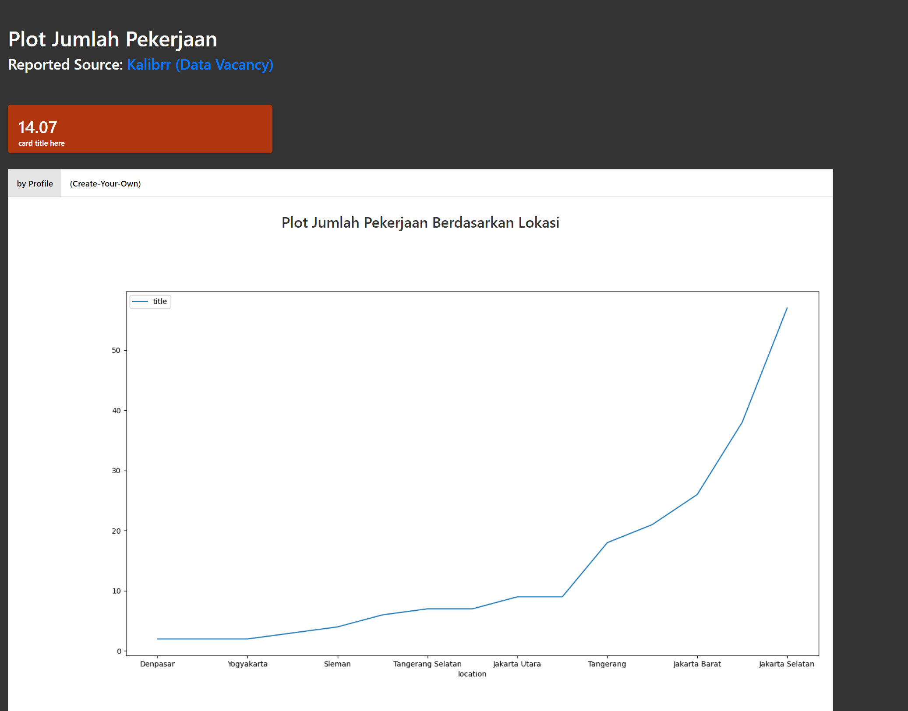
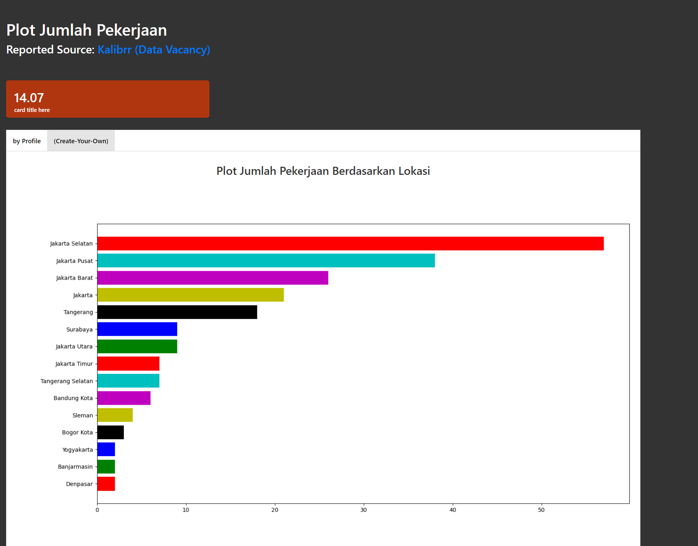
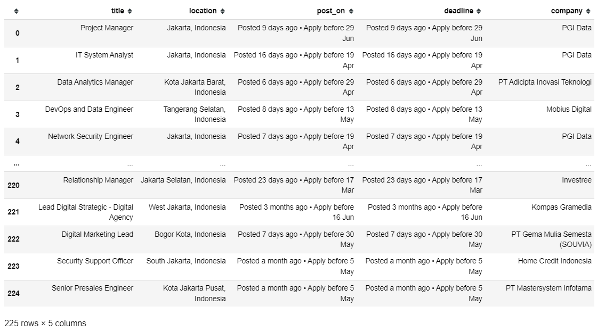

# Web-scrapping_DA
Besides flask-ui, i would like to try the other case of capstone project among 4. Hope it will finish as well soon.

## Final Mission
For the final mission, i choose to scrap the (Hard) one, Data pekerjaan data di indonesia pada  https://www.kalibrr.id/job-board/te/data/1
- Dari Halaman tersebut carilah title pekerjaan , lokasi pekerjaan , tanggal pekerjaan di post dan dealine submit permohonan, dan perusahaan
- tariklah 15 halaman
- Buatlah plot dari jumlah pekerjaan berdasarkan lokasi.
## Finished skeleton
- for skeleton, i make new notebook 'Skeleton for Scrapping 15 pages' only to focus scrapping 15 pages from website, the result of unclean data i save into vacancy.csv to make it easier if we want to recall it instead of load page from web.

## Result of flask-dashboard

## Kind of Plot

<b>Line Plot<'Default'>:</b>Menunjukkan sebaran frekuensi di antara 8 daerah dengan lowongan pekerjaan di bidang data; mulai dari daerah yang lowongan pekerjaan nya sedikit sampai daerah dengan lowongan pekerjaan di bidang data yang terbanyak 

<b>[Bar plot] Plot jumlah pekerjaan berdasarkan lokasi:</b>Plot ini menunjukkan 15 Lokasi dengan pembukaan lowongan pekerjaan di bidang data terbanyak, daerah tersebut kurang lebih;
 
<ul>
<li>Jakarta</li>
<li>Tanagerang</li>
<li>Surabaya</li>
<li>Bandung</li>
<li>Sleman</li>
<li>Yogyakarta</li>
<li>Banjarmasin</li>
<li>Denpasar</li>
</ul>
Namun, untuk lokasi tetap daerah Jakarta memegang proporsi tertinggi dengan Top 3 lokasi yakni;
<ol>
<li>Jakarta Selatan</li>
<li>Jakarta Pusat</li>
<li>Jakarta Barat</li>
</ol>

<b>[Bar plot] Plot jumlah company/perusahaan yang membuka lowongan terbanyak:</b>Plot ini menunjukkan 20 Company/Perusahaan dengan pembukaan lowongan pekerjaan di bidang data terbanyak, baik perusahaan settle ataupun start-up rupanya masih memiliki demand yang besar terhadap kebutuhan tenaga pekerja expertise di bidang data
 

## Challenges
- cleaning data

- etc..