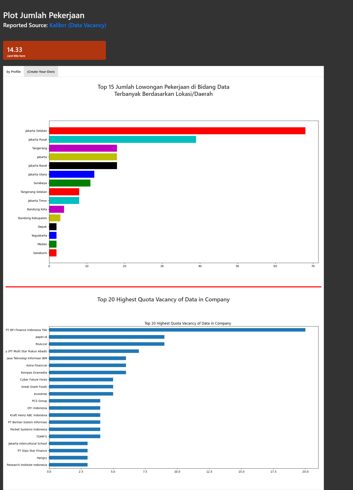

# Web-scrapping_DA
Besides flask-ui, i would like to try the other case of capstone project among 4. Hope it will finish as well soon.

## Final Mission
For the final mission, i choose to scrap the (Hard) one, Data pekerjaan data di indonesia pada  https://www.kalibrr.id/job-board/te/data/1
- Dari Halaman tersebut carilah title pekerjaan , lokasi pekerjaan , tanggal pekerjaan di post dan dealine submit permohonan, dan perusahaan
- tariklah 15 halaman
- Buatlah plot dari jumlah pekerjaan berdasarkan lokasi.
## Finished skeleton
- for skeleton, i make new notebook 'Skeleton for Scrapping 15 pages' only to focus scrapping 15 pages from website, the result of unclean data i save into .csv to make it easier if we want to recall it instead of load page from web.

<b>simple bar plot analysis:</b> jakarta especially jakarta selatan has the most vacancy in 'data' occupation than any location, second is jakarta pusat.
## Result of flask-dashboard

## Challenges
- cleaning data

- etc..