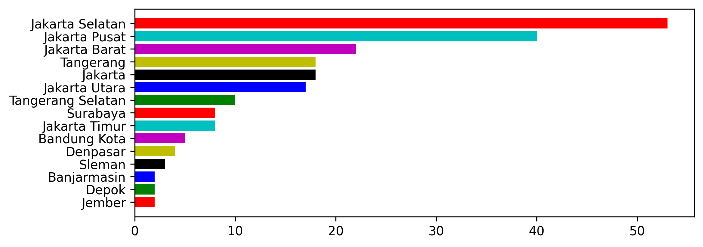
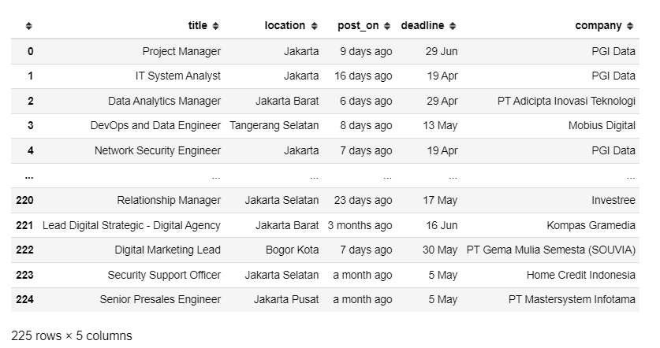

# Web-scrapping_DA
Besides flask-ui, i would like to try the other case of capstone project among 4. Hope it will finish as well soon.

## Final Mission
For the final mission, i choose to scrap the (Hard) one, Data pekerjaan data di indonesia pada  https://www.kalibrr.id/job-board/te/data/1
- Dari Halaman tersebut carilah title pekerjaan , lokasi pekerjaan , tanggal pekerjaan di post dan dealine submit permohonan, dan perusahaan
- tariklah 15 halaman
- Buatlah plot dari jumlah pekerjaan berdasarkan lokasi.

## Finished skeleton

simple bar plot analysis: jakarta especially jakarta pusat has the most vacancy in data than any location, second is tangerang especially in tangerang selatan.

## Challenges
- cleaning data

- etc..